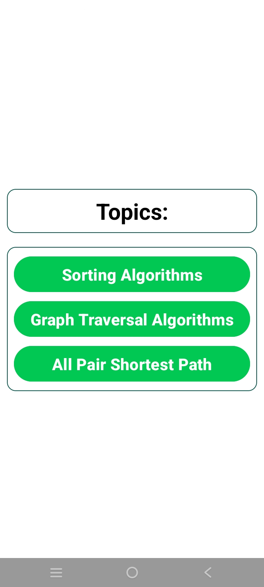
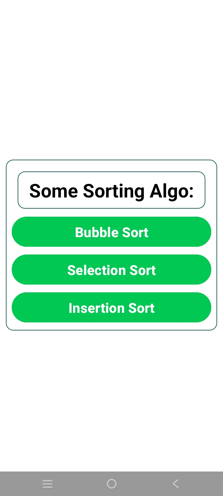
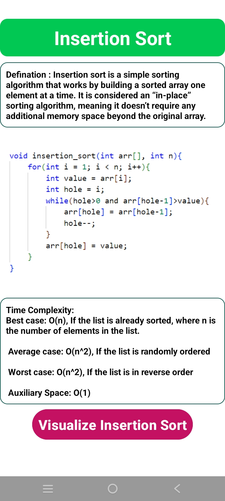
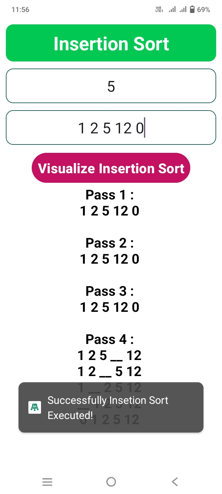
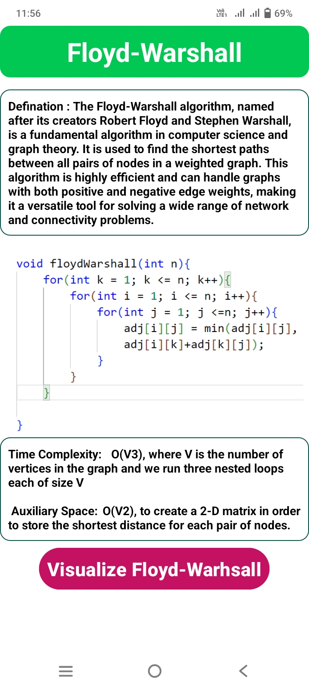
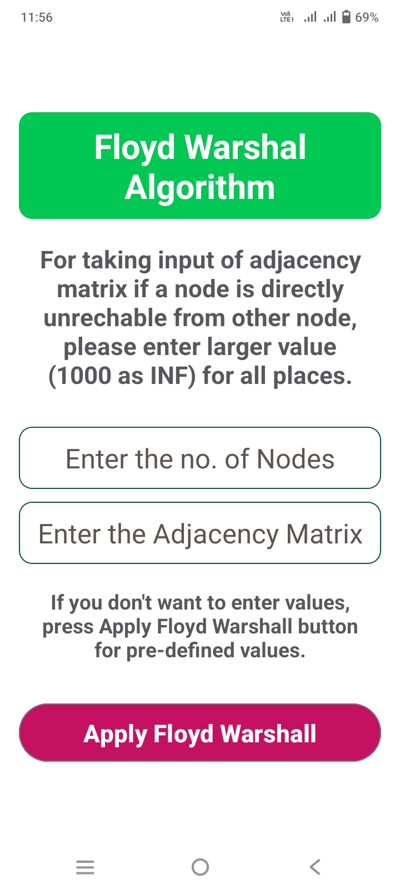

# 🚀 Algo Express – Algorithm Visualizer  

**Algo Express** is an **Android app** built with **Java** that helps users visualize sorting algorithms and the **Floyd-Warshall algorithm** interactively. It provides step-by-step animations, making it easier to understand algorithm behavior.  

## ✨ Features  
✅ **Sorting Algorithm Visualization**  
   - Bubble Sort  
   - Selection Sort  
   - Insertion Sort  
✅ **Pathfinding Algorithm Visualization**  
   - Floyd-Warshall Algorithm  
✅ **Step-by-step Execution** – Watch each step in real time.  
✅ **Intuitive UI** – Simple and interactive design for better understanding.  

## 🛠️ Tech Stack  
- **Language:** Java  
- **Framework:** Android SDK  
- **UI Design:** XML  

## 📸 Screenshots  
 
 
 
 
 
 
 

 

## 🚀 Installation  
1. Clone the repository:  
   ```sh
   git clone https://github.com/SRHridoy/Algorithm-Group-Project.git


🔥 Future Enhancements
✅ Add Merge Sort and Quick Sort.
✅ Improve UI for better visualization.
✅ Allow users to input custom data for sorting.

👨‍💻 Developed by Md. Sohanur Rahman Hridoy
💬 Let’s connect and collaborate!

#Java #Android #Algorithms #Sorting #Pathfinding #Visualization #AlgoExpress